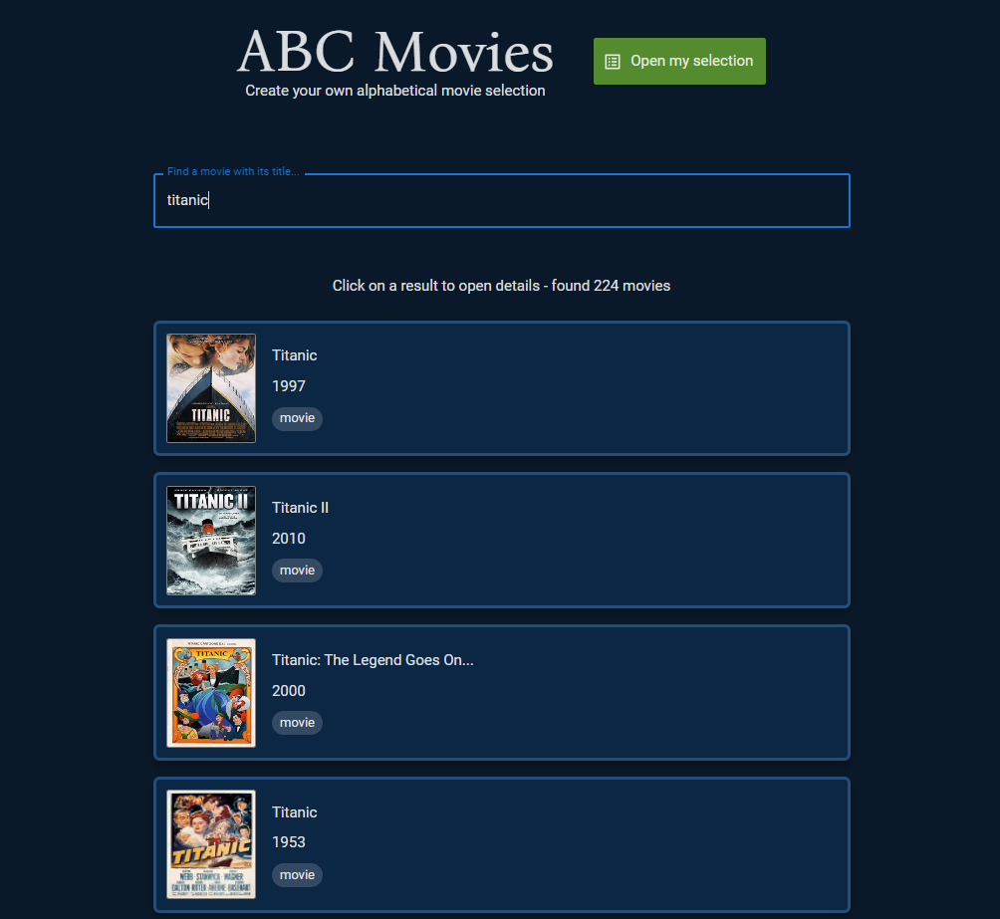
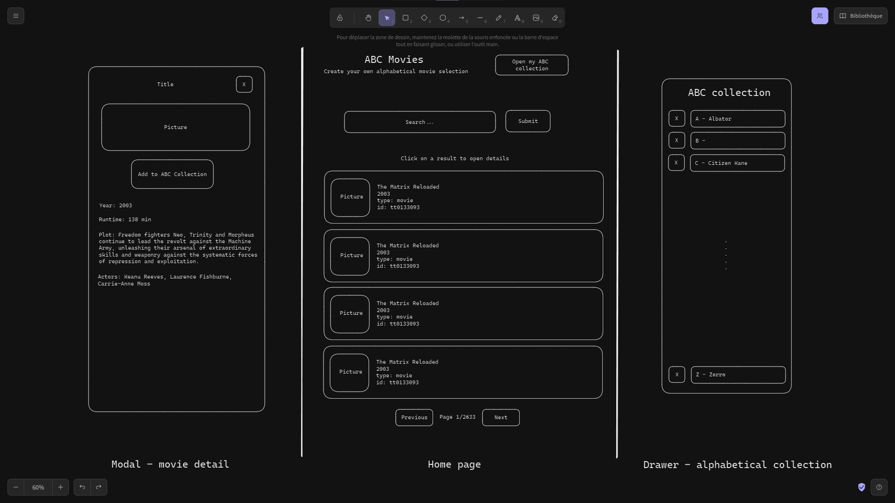

ABC Movies is an app that allows a user to build an alphabetical selection of its favorite movies. The user can search its favorite movies in the large library provided by [www.omdbapi.com](https://www.omdbapi.com/)

A live version of the project is available here: [abc-movies.belkross.com](https://abc-movies.belkross.com/)

This is the prototype I made before starting the development of the app

# Instructions

The instructions related to the project can be found here:
[Instructions](./INSTRUCTIONS.md)

# Deployment

To run a local version of the project, follow these instructions:

1. clone the project: `git clone https://github.com/Belkross/abc-movies.git`
2. move to the project folder: `cd abc-movies`
3. install dependencies: `npm install`
4. create a .env file at the root of the project
   1. add the following fields and replace their value with yours:  
      `VITE_APP_NAME="ABC Movies"`  
      `VITE_OMDB_API_KEY="default api key"`
5. launch the app locally: `npm run dev`
6. The app is now available in your web navigator here: http://localhost:5173

WARNING: You might experience a white screen during around 30 seconds for the first time you launch the app.
